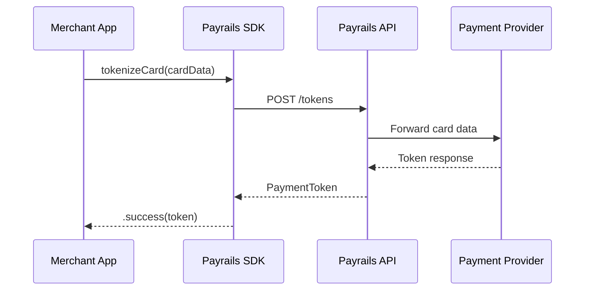

# Divio SDK Documentation Skill — iOS SDK (Swift)

This skill enforces the [Divio Documentation System](https://documentation.divio.com) —
a framework that organizes all documentation into four distinct types. Each type serves
a different user need and must never be mixed together.

> **Core Rule**: Every doc artifact you produce must belong to exactly one Divio quadrant.
> Never blend types in a single document. If content spans multiple types, split it.

---

## The Four Quadrants — Quick Reference

| Type | Oriented toward | Answers | Analogy |
|---|---|---|---|
| **Tutorial** | Learning | "How do I get started?" | Teaching a child to cook |
| **How-To Guide** | Tasks | "How do I solve X?" | A recipe |
| **Explanation** | Understanding | "Why does it work this way?" | An essay |
| **API Reference** | Information | "What does X do exactly?" | An encyclopedia entry |

---

## iOS SDK Specifics

### Language & Platform

- **All code examples must be Swift only** — no Objective-C.
- Target audience: iOS developers integrating Payrails payments.
- Assume familiarity with SwiftUI, UIKit, SPM, and CocoaPods.
- All examples must compile against the SDK's minimum deployment target.

### Diagrams

Every document that describes a flow, lifecycle, or architecture **must include a
Mermaid diagram**. This is mandatory, not optional.

#### When to use which diagram type

| Scenario | Mermaid type | Example |
|---|---|---|
| Multi-party communication (SDK ↔ backend ↔ PSP) | `sequenceDiagram` | Card tokenization flow |
| State transitions (pending → authorized → captured) | `stateDiagram-v2` | Payment lifecycle |
| Decision logic (if card → do X, if PayPal → do Y) | `flowchart TD` | Payment method routing |
| Module/layer relationships | `classDiagram` or `graph TD` | SDK architecture layers |

#### Diagram rules

1. **Every flow-oriented doc needs at least one diagram** — tokenization, 3DS, stored
   instruments, checkout amount updates, etc.
2. Place the diagram **before** the prose that explains it. The reader should see the
   visual overview first, then read details.
3. Keep diagrams focused — max 12 nodes. If larger, split into sub-diagrams.
4. Use clear labels: `Merchant App`, `Payrails SDK`, `Payrails API`, `PSP` — not
   abbreviations like `MA`, `PS`, `PA`.
5. Always wrap in a triple-backtick mermaid code fence.

#### Example — Card Tokenization Sequence

````markdown

````

### Existing Docs Layout

The iOS SDK already has flat docs in `docs/` and structured docs in `docs/public/`
and `docs/internal/`. When creating or updating documentation:

- **Public docs** go in `docs/public/` — these are merchant-facing.
- **Internal docs** go in `docs/internal/` — these are for SDK contributors.
- **Existing flat docs** in `docs/` root are legacy and should be left as-is.

---

## Workflow: What to Do on Every Documentation Task

### Step 1 — Classify the trigger

Before writing anything, identify what triggered the doc task:

- **New feature added** → Requires ALL FOUR quadrant updates (see New Feature Checklist below)
- **Bug fix** → Usually only API Reference update + possibly a How-To if the fix changes usage
- **Refactor (no API change)** → Explanation update if internals changed; Reference if signatures changed
- **User asked a "how do I" question** → Produce a How-To Guide
- **User asked "why does X work"** → Produce an Explanation
- **Onboarding / getting started** → Produce or update a Tutorial
- **Commit touches a public API** → API Reference is mandatory

### Step 2 — Check existing docs

Before creating new files, check if a relevant doc already exists:
- If yes: update it, preserving its quadrant type
- If no: create it in the correct location (see File Structure below)

### Step 3 — Write using the correct template

Fill in every section of the appropriate quadrant template. Do not skip sections —
if content is thin, that signals the feature needs more thought, not that sections
should be omitted.

### Step 4 — Add diagrams

For any document that describes a flow, lifecycle, or multi-step process:
1. Identify the right Mermaid diagram type (see table above).
2. Draft the diagram **first**, then write the prose around it.
3. Verify the diagram renders correctly in a Mermaid live editor.

### Step 5 — Self-review with the checklist

After writing, run through the checklist below before declaring the doc complete.

---

## New Feature Checklist

When a new feature is added to the SDK, all four of the following must exist or be created:

```
[ ] TUTORIAL entry or update
    - Does the getting-started tutorial still work end-to-end with this feature available?
    - If the feature is significant, does it deserve its own tutorial?

[ ] HOW-TO GUIDE
    - At least one guide showing the most common use case for the feature
    - Title must start with "How to..."
    - Must include a Mermaid diagram if the feature involves a multi-step flow

[ ] EXPLANATION
    - Why was this feature designed this way?
    - What problem does it solve? What tradeoffs were made?
    - What should users understand conceptually before using it?
    - Must include a Mermaid diagram for architecture or state-related concepts

[ ] API REFERENCE
    - Every public function, class, method, parameter, return type, and thrown error
    - Must be generated from or consistent with Swift source code
    - Includes a short Swift example per function/method
```

If any quadrant is missing, the documentation task is **incomplete**. Flag this
explicitly in your response: *"Missing: Explanation doc for [feature]. Creating now."*

---

## File Structure

```
docs/
├── public/                          ← Merchant-facing documentation
│   ├── quick-start.md               ← Tutorial: primary onboarding
│   ├── concepts.md                  ← Explanation: core concepts
│   ├── sdk-api-reference.md         ← Reference: full API surface
│   ├── merchant-styling-guide.md    ← How-To: customizing UI
│   ├── how-to-tokenize-card.md      ← How-To: card tokenization
│   ├── how-to-query-session-data.md ← How-To: querying session data
│   ├── how-to-update-checkout-amount.md ← How-To: updating amounts
│   └── troubleshooting.md           ← Reference: common issues
│
├── internal/                        ← Contributor documentation
│   ├── architecture.md              ← Explanation: SDK internals
│   ├── coding-guidelines.md         ← Reference: code standards
│   ├── error-handling.md            ← Explanation: error strategy
│   ├── merchant-usage-guide.md      ← How-To: integration patterns
│   ├── payrails-query-extension-guide.md ← How-To: query extensions
│   ├── public-api-audit.md          ← Reference: API audit trail
│   └── releasing.md                 ← How-To: release process
│
└── *.md                             ← Legacy flat docs (do not modify)
```

---

## Critical Rules (Never Violate)

1. **Never mix quadrant types in one document.** A How-To that turns into an explanation
   halfway through is wrong. Split it.

2. **Tutorials must always work.** Every Swift snippet in a tutorial must be compilable and
   correct. Never write tutorial code you haven't mentally traced through completely.

3. **How-To Guides assume competence.** Do not explain concepts in a How-To. Link to
   the Explanation instead.

4. **API Reference is descriptive, not instructional.** It describes what exists, not
   what to do. No "you should" language. No narrative.

5. **Explanations have no steps.** If you find yourself writing numbered steps in an
   Explanation, stop — that content belongs in a How-To or Tutorial.

6. **Every public API surface must be documented.** If code is exported/public and
   undocumented, flag it and create the Reference entry.

7. **Swift only.** No Objective-C examples, ever. All code must be idiomatic Swift.

8. **Diagrams are mandatory for flows.** Any document describing a payment flow,
   lifecycle, authentication sequence, or multi-step process must include at least one
   Mermaid diagram. A flow doc without a diagram is incomplete.

---

## Pre-Publish Checklist

```
[ ] Document belongs to exactly ONE Divio quadrant
[ ] Title clearly signals the quadrant type
[ ] All Swift code compiles and is idiomatic
[ ] No Objective-C anywhere
[ ] Flow-oriented docs include at least one Mermaid diagram
[ ] Diagrams appear BEFORE the prose that explains them
[ ] Diagrams have ≤ 12 nodes and use full labels (not abbreviations)
[ ] Cross-references link to the correct quadrant (How-To links to Explanation, not vice versa)
[ ] No concepts explained inside a How-To (link to Explanation instead)
[ ] No steps inside an Explanation (move to How-To)
[ ] API Reference entries match current Swift source signatures
[ ] File is in the correct directory (public/ or internal/)
```
