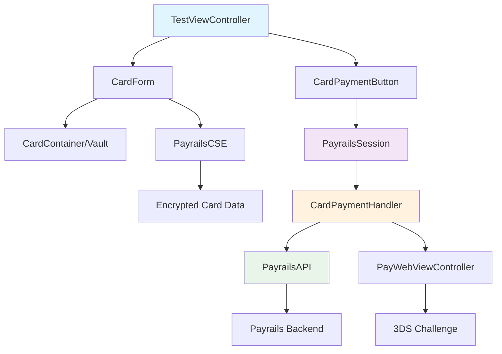
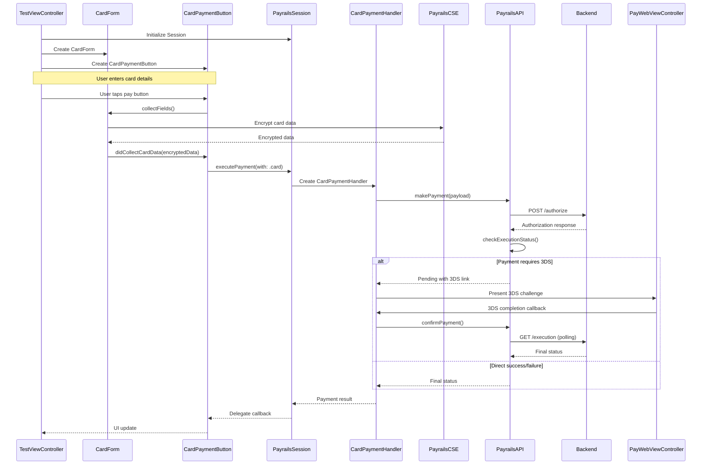
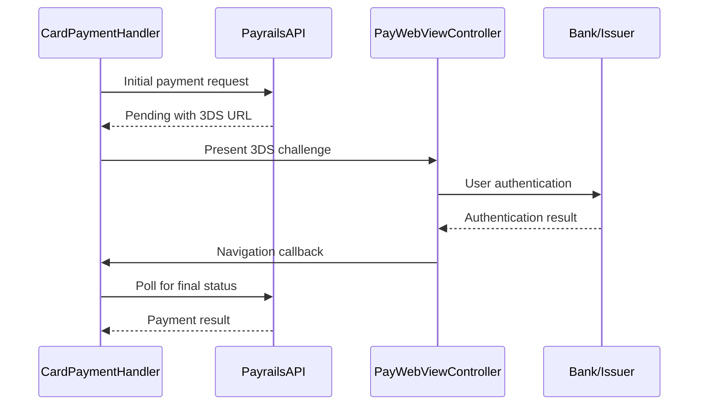

# Payrails iOS SDK - Card Payment Flow Technical Documentation

## Table of Contents
1. [Overview](#overview)
2. [Architecture Overview](#architecture-overview)
3. [Component Architecture](#component-architecture)
4. [Payment Flow Sequence](#payment-flow-sequence)
5. [Key Classes and Components](#key-classes-and-components)
6. [Data Models](#data-models)
7. [Security and Encryption](#security-and-encryption)
8. [Integration Guide](#integration-guide)
9. [Error Handling](#error-handling)

## Overview

The Payrails iOS SDK provides a comprehensive card payment solution that handles secure card data collection, encryption, and payment processing. The SDK follows a modular architecture with clear separation of concerns between UI components, payment handlers, session management, and API communication.

### Key Features
- Secure card data collection with field-level encryption
- 3D Secure authentication support
- Customizable UI components
- Comprehensive error handling
- Support for stored payment instruments
- Real-time payment status tracking

## Architecture Overview



## Component Architecture

### UI Layer
- **CardForm**: Secure card data collection interface
- **CardPaymentButton**: Payment trigger and status management
- **PayWebViewController**: 3D Secure challenge presentation

### Business Logic Layer
- **PayrailsSession**: Central session management and payment orchestration
- **CardPaymentHandler**: Card-specific payment processing logic
- **PayrailsAPI**: HTTP communication with backend services

### Security Layer
- **PayrailsCSE**: Client-side encryption for card data
- **CardContainer/Vault**: Secure field management using Skyflow

## Payment Flow Sequence



## Key Classes and Components

### 1. PayrailsSession

**Location**: `Payrails/Classes/Public/PayrailsSession.swift`

**Responsibilities**:
- Central payment orchestration
- Session lifecycle management
- Payment handler creation and management
- Configuration parsing and validation

**Key Methods**:
```swift
func executePayment(
    with type: PaymentType,
    saveInstrument: Bool = false,
    presenter: PaymentPresenter?
) async -> OnPayResult

func isPaymentAvailable(type: PaymentType) -> Bool
func storedInstruments(for type: PaymentType) -> [StoredInstrument]
```

**Key Properties**:
- `executionId`: Unique identifier for payment session
- `isPaymentInProgress`: Payment state tracking
- `config`: SDK configuration and payment options

### 2. CardForm

**Location**: `Payrails/Classes/Public/Views/Card/CardForm.swift`

**Responsibilities**:
- Secure card data collection
- Field validation and formatting
- UI customization and styling
- Save instrument toggle management

**Key Methods**:
```swift
func collectFields() // Triggers card data collection and encryption
```

**Key Properties**:
- `saveInstrument`: Boolean flag for storing payment instrument
- `delegate`: PayrailsCardFormDelegate for callbacks
- `cardContainer`: Secure field container

**Configuration**:
```swift
struct CardFormConfig {
    let showNameField: Bool
    let styles: CardFormStylesConfig?
    let translations: CardTranslations?
    let showSaveInstrument: Bool
}
```

### 3. CardPaymentButton

**Location**: `Payrails/Classes/Public/Views/CardPaymentButton.swift`

**Responsibilities**:
- Payment initiation
- Loading state management
- Payment result handling
- Delegate communication

**Key Methods**:
```swift
func pay(with type: PaymentType?, storedInstrument: StoredInstrument?)
```

**Delegate Protocol**:
```swift
protocol PayrailsCardPaymentButtonDelegate: AnyObject {
    func onPaymentButtonClicked(_ button: CardPaymentButton)
    func onAuthorizeSuccess(_ button: CardPaymentButton)
    func onThreeDSecureChallenge(_ button: CardPaymentButton)
    func onAuthorizeFailed(_ button: CardPaymentButton)
}
```

### 4. CardPaymentHandler

**Location**: `Payrails/Classes/Public/PaymentHelpers/CardPaymentHandler.swift`

**Responsibilities**:
- Card payment processing logic
- 3D Secure flow management
- Payment composition creation
- WebView navigation handling

**Key Methods**:
```swift
func makePayment(total: Double, currency: String, presenter: PaymentPresenter?)
func handlePendingState(with executionResult: GetExecutionResult)
func processSuccessPayload(payload: [String: Any]?, amount: Amount, completion: @escaping (Result<[String: Any], Error>) -> Void)
```

### 5. PayrailsAPI

**Location**: `Payrails/Classes/Public/PaymentHelpers/PayrailsAPI.swift`

**Responsibilities**:
- HTTP communication with backend
- Payment status polling
- Request/response handling
- Authentication management

**Key Methods**:
```swift
func makePayment(type: PaymentType, payload: [String: Any]?) async throws -> PaymentStatus
func confirmPayment(link: Link, payload: [String: Any]?, type: PaymentType?) async throws -> PaymentStatus
func checkExecutionStatus(url: URL, targetStatuses: [PaymentAuthorizeStatus]) async throws -> PaymentStatus
```

**Payment Status Enum**:
```swift
enum PaymentStatus {
    case success
    case failed
    case pending(GetExecutionResult)
}
```

### 6. PayrailsCSE (Client-Side Encryption)

**Responsibilities**:
- Card data encryption
- Secure key management
- Data format standardization

**Integration**:
```swift
let payrailsCard = Card(
    holderReference: holderReference,
    cardNumber: cardNumber,
    expiryMonth: expiryMonth,
    expiryYear: expiryYear,
    holderName: holderName,
    securityCode: securityCode
)

let encryptedData = try payrailsCSE.encryptCardData(card: payrailsCard)
```

## Data Models

### PaymentComposition

**Location**: `Payrails/Classes/Public/Domains/PaymentComposition.swift`

```swift
struct PaymentComposition {
    let paymentMethodCode: String
    let integrationType: String
    let amount: Amount
    let storeInstrument: Bool
    let paymentInstrumentData: Any?
    let enrollInstrumentToNetworkOffers: Bool?
}

struct PaymentInstrumentData {
    let encryptedData: String
    let vaultProviderConfigId: String
    let billingAddress: BillingAddress
}
```

### Payment Flow Models

**Location**: `Payrails/Classes/Public/Domains/PaymentFlow.swift`

```swift
struct AuthorizeResponse: Decodable {
    let name: String
    let actionId: String
    let links: AuthorizeLinks
    let executedAt: Date
}

struct GetExecutionResult: Decodable {
    let id: String
    let status: [Status]
    let createdAt: Date
    let merchantReference: String
    let holderReference: String
    let workflow: Workflow
    let links: ExecutionLinks
    let actionRequired: String?
}
```

### Configuration Models

```swift
struct CardFormConfig {
    let showNameField: Bool
    let styles: CardFormStylesConfig?
    let translations: CardTranslations?
    let showSaveInstrument: Bool
}

struct CardFormStylesConfig {
    let wrapperStyle: CardWrapperStyle?
    let errorTextStyle: CardStyle?
    let allInputFieldStyles: CardFieldSpecificStyles?
    let inputFieldStyles: [CardFieldType: CardFieldSpecificStyles]?
    let labelStyles: [CardFieldType: CardStyle]?
}
```

## Security and Encryption

### Card Data Security

1. **Field-Level Encryption**: Card data is encrypted at the field level using PayrailsCSE
2. **Secure Containers**: Sensitive fields are managed through secure containers (Skyflow integration)
3. **No Plain Text Storage**: Card data never exists in plain text in memory or storage
4. **Tokenization**: Card data is tokenized for secure transmission

### 3D Secure Authentication



### Security Best Practices

1. **Encryption**: All card data is encrypted before transmission
2. **Secure Communication**: HTTPS with certificate pinning
3. **Memory Management**: Sensitive data is cleared from memory after use
4. **Validation**: Client-side validation with server-side verification
5. **Compliance**: PCI DSS compliant data handling

## Integration Guide

### Basic Integration

```swift
// 1. Initialize SDK Session
let configuration = Payrails.Configuration(
    initData: response,
    option: Payrails.Options(env: Payrails.Env.dev)
)
let payrails = try await Payrails.createSession(with: configuration)

// 2. Create Card Form
let cardFormConfig = CardFormConfig(
    showNameField: false,
    styles: customStylesConfig,
    translations: translations,
    showSaveInstrument: true
)
let cardForm = Payrails.createCardForm(config: cardFormConfig, showSaveInstrument: true)

// 3. Create Payment Button
let cardPaymentButton = Payrails.createCardPaymentButton(
    buttonStyle: CardButtonStyle(backgroundColor: .green),
    translations: CardPaymenButtonTranslations(label: "Pay now")
)

// 4. Set Delegates
cardPaymentButton.delegate = self
cardPaymentButton.presenter = self

// 5. Add to UI
stackView.addArrangedSubview(cardForm)
stackView.addArrangedSubview(cardPaymentButton)
```

### Delegate Implementation

```swift
extension ViewController: PayrailsCardPaymentButtonDelegate {
    func onPaymentButtonClicked(_ button: CardPaymentButton) {
        // Handle payment initiation
    }
    
    func onAuthorizeSuccess(_ button: CardPaymentButton) {
        // Handle successful payment
    }
    
    func onThreeDSecureChallenge(_ button: CardPaymentButton) {
        // Handle 3DS challenge presentation
    }
    
    func onAuthorizeFailed(_ button: CardPaymentButton) {
        // Handle payment failure
    }
}

extension ViewController: PaymentPresenter {
    func presentPayment(_ viewController: UIViewController) {
        present(viewController, animated: true)
    }
    
    var encryptedCardData: String? {
        get { return _encryptedCardData }
        set { _encryptedCardData = newValue }
    }
}
```

### Customization Options

#### Styling
```swift
let customStylesConfig = CardFormStylesConfig(
    wrapperStyle: CardWrapperStyle(
        backgroundColor: .white,
        borderWidth: 1,
        cornerRadius: 8
    ),
    errorTextStyle: Style(textColor: .red),
    allInputFieldStyles: CardFieldSpecificStyles(
        base: Style(cornerRadius: 8, padding: customPadding, borderWidth: 1),
        focus: Style(borderColor: .purple, borderWidth: 2.0)
    )
)
```

#### Translations
```swift
let customTranslations = CardTranslations(
    placeholders: CardTranslations.Placeholders(values: [
        .CARD_NUMBER: "Enter card number"
    ]),
    labels: CardTranslations.Labels(values: [
        .CARD_NUMBER: "Card Number",
        .CVV: "Security Code"
    ]),
    error: CardTranslations.ErrorMessages(values: [
        .CARD_NUMBER: "Invalid card number"
    ])
)
```

## Error Handling

### Error Types

```swift
enum PayrailsError: Error {
    case invalidDataFormat
    case missingData(String)
    case authenticationError
    case unsupportedPayment(type: PaymentType)
    case incorrectPaymentSetup(type: PaymentType)
    case pollingFailed(String)
    case unknown(error: Error?)
}
```

### Error Handling Patterns

1. **Validation Errors**: Field-level validation with user-friendly messages
2. **Network Errors**: Retry logic with exponential backoff
3. **Authentication Errors**: Token refresh and re-authentication
4. **Payment Errors**: Detailed error codes and recovery suggestions

### Best Practices

1. **Graceful Degradation**: Handle partial failures gracefully
2. **User Feedback**: Provide clear error messages to users
3. **Logging**: Comprehensive logging for debugging
4. **Recovery**: Implement recovery mechanisms where possible

## Conclusion

The Payrails iOS SDK provides a robust, secure, and flexible card payment solution. The modular architecture ensures maintainability and extensibility, while the comprehensive security measures protect sensitive payment data throughout the entire flow.

Key strengths:
- **Security**: End-to-end encryption and PCI compliance
- **Flexibility**: Extensive customization options
- **Reliability**: Comprehensive error handling and retry logic
- **User Experience**: Smooth payment flow with 3DS support
- **Developer Experience**: Clear APIs and comprehensive documentation

For additional support or questions, refer to the SDK documentation or contact the Payrails development team.
