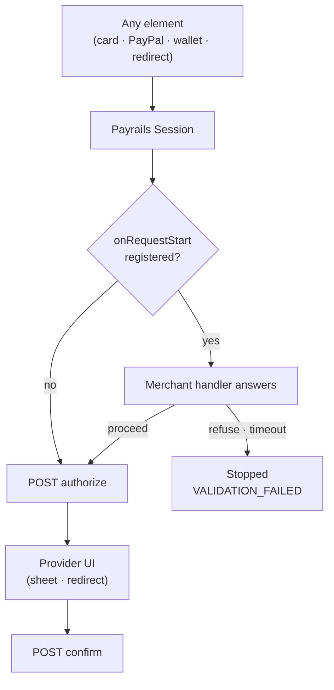

# Concepts

This page explains the mental model behind the Payrails iOS SDK so you can reason about integration decisions confidently.

---

## The three building blocks

### 1. Session

The **Session** (`Payrails.Session`) is the single source of truth for a checkout. It holds:

- The parsed init payload (amounts, payment method configurations, vault settings)
- The active execution ID
- The holder reference
- Links to backend API actions (BIN lookup, instrument management)

You create a session once per checkout by calling `Payrails.createSession(with:)`. All elements and factory methods draw their configuration from the current session — there is no need to pass it around explicitly.

```
App Backend  ──init payload──►  Payrails.createSession()  ──►  Session (ready)
```

A session does not persist across app launches. When the user starts a new checkout, create a new session.

### 2. Elements

Elements are UIKit views that the SDK manages. You obtain them via factory methods on `Payrails`:

| Factory method | Element type | Description |
|---|---|---|
| `Payrails.createCardForm()` | `Payrails.CardForm` | Card input form (number, expiry, CVV, optional name) |
| `Payrails.createCardPaymentButton(translations:)` | `Payrails.CardPaymentButton` | Submit button for card form or stored instrument |
| `Payrails.createApplePayButton(type:style:)` | `ApplePayElement` | Apple Pay button wrapping `PKPaymentButton` |
| `Payrails.createPayPalButton()` | `PaypalElement` | PayPal checkout button |
| `Payrails.createGenericRedirectButton(translations:paymentMethodCode:)` | `Payrails.GenericRedirectButton` | Button for redirect-based methods (e.g. iDEAL) |
| `Payrails.createStoredInstruments()` | `Payrails.StoredInstruments` | List of previously saved payment methods |

All elements are UIView subclasses; add them to your view hierarchy with Auto Layout or frames.

> **Note:** `Payrails.createCardPaymentButton` requires that `createCardForm` has been called first. The form and button are linked automatically.

### 3. Delegates

Delegates are protocols your view controller (or any object) conforms to in order to receive payment lifecycle events. Each element type has a corresponding delegate:

| Element | Delegate protocol |
|---|---|
| `CardPaymentButton` | `PayrailsCardPaymentButtonDelegate` |
| `ApplePayButton` | `PayrailsApplePayButtonDelegate` |
| `PayPalButton` | `PayrailsPayPalButtonDelegate` |
| `GenericRedirectButton` | `GenericRedirectPaymentButtonDelegate` |
| `StoredInstruments` | `PayrailsStoredInstrumentsDelegate` |
| `StoredInstrumentView` | `PayrailsStoredInstrumentViewDelegate` |

Assign the delegate before adding the element to the window.

---

## Payment flows

### Card payment (new card)

```
1. createCardForm()                — card fields appear
2. createCardPaymentButton()       — pay button appears
3. User fills fields, taps button
4. SDK encrypts card data (PayrailsCSE)
5. SDK calls Payrails payment API
6. ┌─ 3DS required ──► presentPayment(_:) called on PaymentPresenter
│                   ──► user completes challenge in SFSafariViewController
│                   ──► SDK polls for final status
└─ no 3DS  ──► result delivered immediately
7. delegate callback fires:
   - success  → delegate.onAuthorizeSuccess(_:)
   - failure  → delegate.onAuthorizeFailed(_:failure:)
                (failure.code discriminates: .userCancelled / .authorizationError /
                 .authenticationError / .unknownError)
   - pending  → delegate.onAuthorizePending(_:)
   In parallel, if the execution is left in `authorizePending` (e.g. the user
   abandoned 3DS), the SDK fires the `onSessionExpired` closure supplied at
   `createSession` time to swap the internal config in place — the merchant's
   `Session` reference and cached buttons keep working.
```

### Stored instrument payment

```
1. createStoredInstruments() or createCardPaymentButton(storedInstrument:)
2. User selects instrument, taps button
3. SDK calls Payrails payment API with instrument ID
4. Result via delegate callback
```

### Apple Pay

```
1. createApplePayButton(type:style:)
2. User taps button
3. Apple Pay sheet presented by the SDK
4. User authorises with Face ID / Touch ID
5. SDK processes payment token
6. Result via PayrailsApplePayButtonDelegate
```

### PayPal

```
1. createPayPalButton()
2. User taps button
3. PayPal checkout web flow presented
4. SDK confirms payment and polls for status
5. Result via PayrailsPayPalButtonDelegate
```

### Generic redirect

```
1. createGenericRedirectButton(translations:paymentMethodCode:)
2. User taps button
3. Browser opens redirect URL (SFSafariViewController)
4. User completes flow on payment provider website
5. App returns to foreground — success is reported immediately
```

---

## Tokenization

Tokenization saves a payment method as a reusable Payrails **instrument** without charging the customer. It returns a stable instrument `id` that identifies the saved method for later use.

This exists to support a **two-step model**: tokenize first, run the resulting instrument through an external decision — a saved-card list, a subscription setup — and only then, if at all, charge it with `executePayment`. Charging is a separate, deliberate action, never a side effect of tokenizing.

Tokenization is **unified across payment methods**. The same `session.tokenize` call handles Apple Pay (the SDK presents the Apple Pay sheet) and cards (the SDK encrypts the embedded card form), selected by the `TokenizationRequest` case, and both return the same `SaveInstrumentResponse`. Adding a method later does not change how the call is made.

Tokenization is distinct from **pay-and-save**: pay-and-save (the `storeInstrument` toggle on a payment) charges the customer and vaults the method in one step, whereas tokenization vaults without any charge.

---

## 3D Secure

When a card payment requires a 3DS challenge, the SDK presents an `SFSafariViewController`. Your view controller must conform to `PaymentPresenter` and implement `presentPayment(_:)`:

```swift
func presentPayment(_ viewController: UIViewController) {
    present(viewController, animated: true)
}
```

The SDK handles the rest: it polls the Payrails API until a final status is received, then calls the appropriate delegate callback.

> Set `payButton.presenter = self` before the user taps the button.

---

## CardPaymentButton modes

`Payrails.CardPaymentButton` operates in two modes:

| Mode | How it's created | Behaviour on tap |
|---|---|---|
| **Card form mode** | `createCardPaymentButton(translations:)` (requires prior `createCardForm()`) | Collects and encrypts card fields, then executes payment |
| **Stored instrument mode** | `createCardPaymentButton(storedInstrument:translations:)` | Executes payment immediately with the stored instrument |

You can switch between modes at runtime using `setStoredInstrument(_:)` and `clearStoredInstrument()`.

---

## Stored instruments and `bindCardPaymentButton`

`Payrails.StoredInstruments` can be bound to a single `CardPaymentButton`:

```swift
let storedInstrumentsView = Payrails.createStoredInstruments()
let payButton = Payrails.createCardPaymentButton(translations: translations)

storedInstrumentsView.bindCardPaymentButton(payButton)
```

When a user selects an instrument from the list, the button automatically switches to stored instrument mode. When deselected, it reverts to card form mode. This pattern lets you render one card form and one pay button that handles both flows without conditional logic in your view controller.

---

## The pre-authorization gate

Every element — card form, card button, Apple Pay, PayPal, generic redirect, stored instrument —
routes its payment through a single `Session` method. That convergence is what makes one
merchant-supplied gate able to cover all of them, present and future, rather than each element
carrying its own hook.



The gate sits **before** the authorization request and before any provider UI. That position is the
whole point: a merchant revalidating a voucher, wallet balance or loyalty points needs the answer to
arrive while the customer is still on the checkout screen, not after they have approved a payment in
PayPal. Validating when the element is first drawn would answer against a basket the customer can
still change; the further the tap drifts from the check, the staler the answer.

Two design consequences follow.

**Silence is a block, not a pass.** If the handler never answers, the SDK stops the payment after
ten seconds rather than proceeding. A gate whose failure mode is "authorize anyway" gives no
guarantee at all, and the alternative — an element spinning indefinitely because a merchant endpoint
hung — is worse than a refused payment the customer can retry.

**A block is not a decline.** It surfaces as `AuthorizationFailureReason.validationFailed`, distinct
from `authorizationError`, so a merchant's own decision never lands in their analytics as an issuer
rejection. Nothing reached the backend, so there is no payment attempt to reconcile.

**The refusal carries its own reason.** `.refuse(message:)` rather than a bare `false`, because only
the merchant knows *why* they refused — an expired voucher reads differently to a changed basket —
and only they can phrase it for their customer. The message arrives as `AuthorizationFailure.message`,
the same place all other failure text comes from, so it needs no separate channel and no correlation
by `executionId`. The SDK's own timeout diagnostic is deliberately *not* delivered this way: it
describes an integration fault, not something a customer should read.

The handler receives the payment method code and can therefore gate one method while leaving the
rest untouched. It is opt-in: sessions created without it keep a fully synchronous payment path.

### Why not `onPaymentButtonClicked`?

The two hooks look adjacent but answer different questions, and conflating them is the mistake worth
avoiding:

| | `onPaymentButtonClicked` | `onRequestStart` |
|---|---|---|
| Purpose | The customer tapped | May this payment proceed? |
| Returns | `Void` | A `Bool`, via its completion |
| SDK waits for it | No | Yes |
| Can stop the payment | No | Yes |
| Use for | Analytics, observability, spinners | Any check the payment depends on |

`onPaymentButtonClicked` is deliberately a notification. It cannot gate anything, because the SDK
never looks at it and does not wait — work started inside it races the authorization rather than
preceding it. The Web SDK draws the same line between its `buttonClicked` and `requestStart` events.

See [How to run a merchant check before authorization](how-to-gate-payment-authorization.md).

---

## Security model

- **Card data is never exposed in plaintext.** The SDK encrypts card fields using PayrailsCSE (a Skyflow vault client) before they leave the device.
- **The Session token is short-lived.** Tokens are fetched by your backend and passed to the SDK; they are not stored persistently.
- **Logging is off by default.** The debug overlay and `Payrails.log` output are only visible when explicitly enabled. See [Troubleshooting](troubleshooting.md) for details.

---

## Element lifecycle

Elements hold a weak reference to the session. They are safe to create in `viewDidLoad` and will be deallocated with the view controller. You do not need to manually tear them down.

If the user navigates away during a payment, the in-flight `Task` is cancelled in `deinit` of `CardPaymentButton`, preventing dangling callbacks.

---

## Next steps

- [Quick Start](quick-start.md) — get to a running integration in 15 minutes
- [SDK API Reference](sdk-api-reference.md) — complete API surface
- [Styling Guide](merchant-styling-guide.md) — customise the UI
- [How to run a merchant check before authorization](how-to-gate-payment-authorization.md) — gate a payment on your own backend
