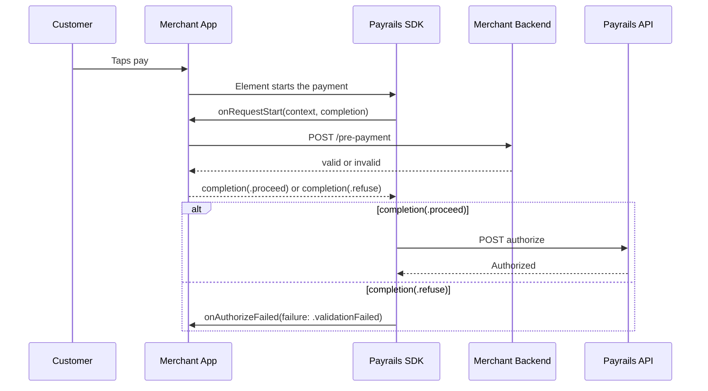

# How to run a merchant check before authorization

Use `onRequestStart` when your backend has to approve a payment before Payrails authorizes it —
revalidating a voucher, confirming wallet balance, or re-checking loyalty points at the moment the
customer commits.

For why the gate sits where it does, see [Concepts → The pre-authorization gate](concepts.md#the-pre-authorization-gate).



## 1. Register the handler

Supply it at `createSession` time, alongside `onSessionExpired`:

```swift
let session = try await Payrails.createSession(
    with: Payrails.Configuration(initData: initData, option: .init(env: .production)),
    onSessionExpired: { completion in
        myBackend.fetchPayrailsInit { completion($0) }
    },
    onRequestStart: { context, completion in
        myBackend.validatePrePayment(executionId: context.executionId) { isValid in
            completion(isValid ? .proceed : .refuse(message: "Your basket is no longer valid."))
        }
    }
)
```

## 2. Gate only the methods you care about

The handler fires for every payment method on the session. Call `completion(.proceed)` on the
branches you are not gating, or those payments will be blocked too:

```swift
onRequestStart: { context, completion in
    guard context.paymentMethodCode == "payPal" else {
        completion(.proceed)
        return
    }
    myBackend.validatePrePayment(executionId: context.executionId) { isValid in
        completion(isValid)
    }
}
```

## 3. Always answer, including on failure

The SDK waits ten seconds, then blocks the payment and logs a warning. Answer explicitly on your
error paths so the outcome is your decision rather than a timeout:

```swift
onRequestStart: { context, completion in
    myBackend.validatePrePayment(executionId: context.executionId) { result in
        switch result {
        case .success(let check):
            completion(check.isValid ? .proceed : .refuse(message: check.reason))
        case .failure:
            // Your service is unreachable. Decide deliberately: .refuse stops the payment,
            // .proceed accepts the risk of an unvalidated basket.
            completion(.refuse(message: "We couldn't confirm your basket. Please try again."))
        }
    }
}
```

## 4. Handle the block in your delegate

A blocked payment arrives as `onAuthorizeFailed(_:failure:)` with `failure.code == .validationFailed`.
Separate it from a decline — nothing reached the backend, so there is no failed payment to explain:

```swift
extension CheckoutViewController: PayrailsPayPalButtonDelegate {
    func onPaymentButtonClicked(_ button: Payrails.PayPalButton) {}
    func onAuthorizeSuccess(_ button: Payrails.PayPalButton) {
        showReceipt()
    }
    func onPaymentSessionExpired(_ button: Payrails.PayPalButton) {
        showRetry()
    }

    func onAuthorizeFailed(_ button: Payrails.PayPalButton, failure: AuthorizationFailure) {
        switch failure.code {
        case .validationFailed:
            // Your own check refused it. failure.message is the reason you passed to
            // .refuse(message:), so you can show it directly instead of mapping a code.
            showBasketChangedMessage(failure.message)
        case .authorizationError:
            showDeclineMessage()         // the issuer refused it
        default:
            showGenericError(failure.message)
        }
    }
}
```

## Reference

| Context field | Type | Notes |
|---|---|---|
| `executionId` | `String?` | The Payrails execution, when known |
| `paymentMethodCode` | `String` | `"card"`, `"payPal"`, `"applePay"`, … |
| `action` | `Action` | Always `.authorize` in this version |

| Handler behaviour | Result |
|---|---|
| `completion(.proceed)` | Authorization proceeds |
| `completion(.refuse(message:))` | Stopped as `.validationFailed`, carrying your `message` |
| `completion(.refuse())` | Stopped as `.validationFailed` with a generic description |
| No answer within 10 seconds | Stopped with a generic description, warning logged |
| `completion` called twice | First answer decides |

Only a deliberate `.refuse(message:)` reaches `failure.message`. The timeout logs its diagnostic
instead of surfacing it — it describes an integration fault rather than anything phrased for a
customer.

Refusing never sends an authorization request and returns the element to its idle state.

## Related

- [SDK API Reference → `onRequestStart`](sdk-api-reference.md#onrequeststart)
- [Concepts → The pre-authorization gate](concepts.md#the-pre-authorization-gate)
- [Troubleshooting](troubleshooting.md)
