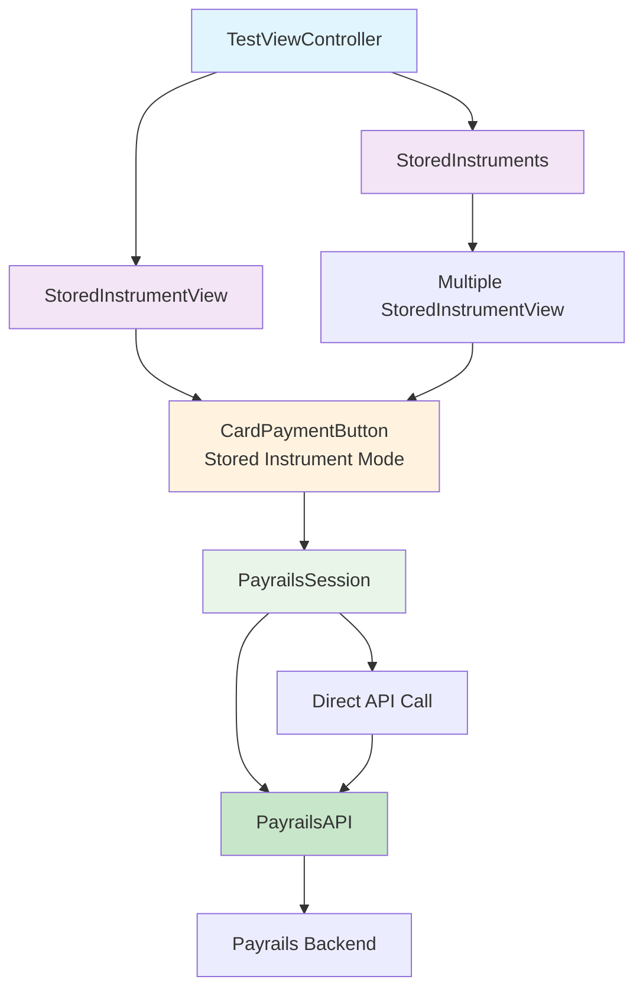
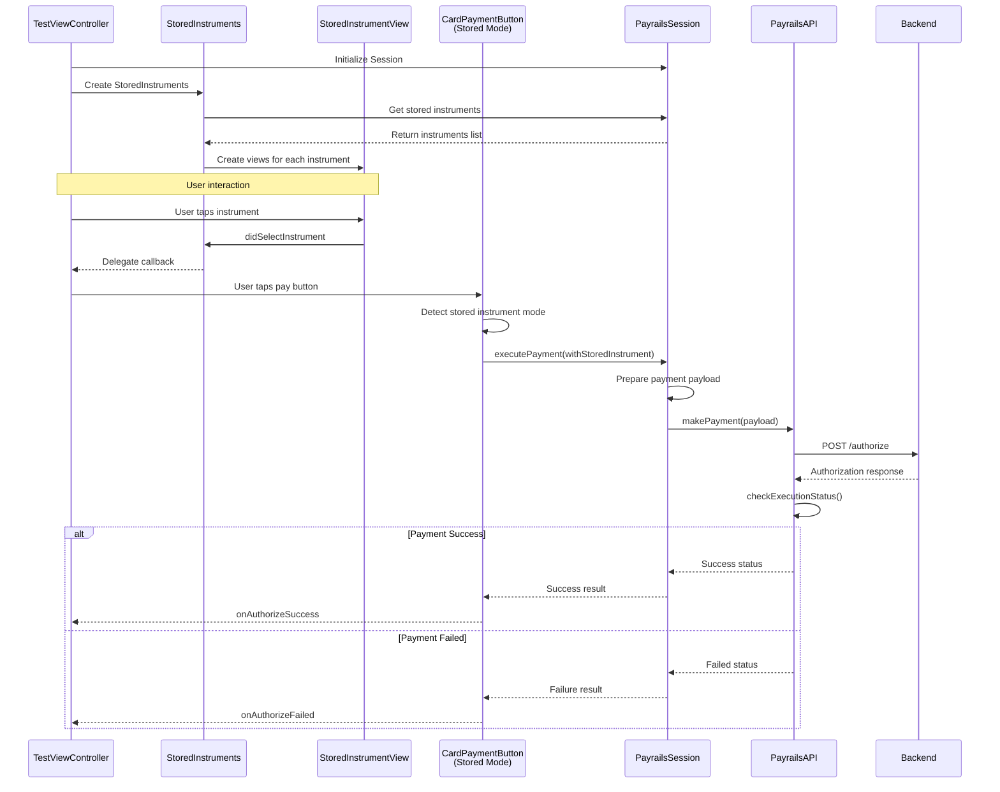

# Payrails iOS SDK - Stored Instrument Payment Flow Technical Documentation

## Table of Contents
1. [Overview](#overview)
2. [Architecture Overview](#architecture-overview)
3. [Component Architecture](#component-architecture)
4. [Payment Flow Sequence](#payment-flow-sequence)
5. [Key Classes and Components](#key-classes-and-components)
6. [Data Models](#data-models)
7. [Integration Guide](#integration-guide)
8. [Customization and Styling](#customization-and-styling)
9. [Delete Functionality](#delete-functionality)
10. [Error Handling](#error-handling)

## Overview

The Payrails iOS SDK provides a comprehensive stored instrument payment solution that enables users to make payments using previously saved payment methods. This feature supports both card and PayPal stored instruments, offering a streamlined checkout experience with minimal user interaction.

### Key Features
- Support for multiple payment method types (Card and PayPal)
- Single and multiple instrument display options
- One-tap payment execution
- Instrument management (delete functionality)
- Customizable UI components
- Real-time payment status tracking
- Comprehensive delegate callbacks

### Benefits
- **Improved User Experience**: Faster checkout with saved payment methods
- **Higher Conversion Rates**: Reduced friction in the payment process
- **Security**: No need to re-enter sensitive payment information
- **Flexibility**: Support for different payment method types

## Architecture Overview



### Unified Button Architecture
As of the latest SDK version, the `CardPaymentButton` has been enhanced to support both card form payments and stored instrument payments. This unified approach simplifies the architecture and provides a consistent API across different payment scenarios.

## Component Architecture

### UI Layer
- **StoredInstruments**: Container component for displaying multiple stored instruments
- **StoredInstrumentView**: Individual stored instrument display with selection capability
- **CardPaymentButton (Stored Instrument Mode)**: Unified payment button supporting both card form and stored instrument payments

### Business Logic Layer
- **PayrailsSession**: Central session management with stored instrument payment execution
- **PayrailsAPI**: HTTP communication for stored instrument payments

### Data Layer
- **StoredInstrument Protocol**: Defines the structure for stored payment methods
- **Configuration Models**: Styling and translation configurations

### Unified Button Architecture
The `CardPaymentButton` now operates in two modes:
1. **Card Form Mode**: Traditional card data collection and payment
2. **Stored Instrument Mode**: Direct payment using saved payment methods

This unified approach reduces code duplication and provides a consistent API across different payment scenarios.

## Payment Flow Sequence



## Key Classes and Components

### 1. StoredInstruments

**Location**: `Payrails/Classes/Public/Views/StoredInstruments.swift`

**Responsibilities**:
- Display multiple stored instruments
- Manage instrument selection
- Handle payment delegation
- Refresh instruments after changes

**Key Methods**:
```swift
func refreshInstruments() // Reload stored instruments
```

**Delegate Protocol**:
```swift
protocol PayrailsStoredInstrumentsDelegate: AnyObject {
    func storedInstruments(_ view: StoredInstruments, didSelectInstrument instrument: StoredInstrument)
    func storedInstruments(_ view: StoredInstruments, didCompletePaymentForInstrument instrument: StoredInstrument)
    func storedInstruments(_ view: StoredInstruments, didFailPaymentForInstrument instrument: StoredInstrument, error: PayrailsError)
    func storedInstruments(_ view: StoredInstruments, didRequestDeleteInstrument instrument: StoredInstrument)
}
```

### 2. StoredInstrumentView

**Location**: `Payrails/Classes/Public/Views/StoredInstrumentView.swift`

**Responsibilities**:
- Display individual stored instrument
- Handle selection/deselection
- Manage payment button visibility
- Support delete functionality

**Key Methods**:
```swift
func setSelected(_ selected: Bool) // Update selection state
func getInstrument() -> StoredInstrument // Get associated instrument
func setPresenter(_ presenter: PaymentPresenter?) // Set payment presenter
```

**Delegate Protocol**:
```swift
protocol PayrailsStoredInstrumentViewDelegate: AnyObject {
    func storedInstrumentView(_ view: StoredInstrumentView, didSelectInstrument instrument: StoredInstrument)
    func storedInstrumentView(_ view: StoredInstrumentView, didDeselectInstrument instrument: StoredInstrument)
    func storedInstrumentView(_ view: StoredInstrumentView, didCompletePaymentForInstrument instrument: StoredInstrument)
    func storedInstrumentView(_ view: StoredInstrumentView, didFailPaymentForInstrument instrument: StoredInstrument, error: PayrailsError)
    func storedInstrumentView(_ view: StoredInstrumentView, didRequestDeleteInstrument instrument: StoredInstrument)
}
```

### 3. CardPaymentButton (Unified Payment Button)

**Location**: `Payrails/Classes/Public/Views/CardPaymentButton.swift`

**Note**: As of the latest SDK version, `CardPaymentButton` has been enhanced to support both card form payments and stored instrument payments. The separate `StoredInstrumentPaymentButton` is now deprecated.

**Responsibilities**:
- Execute both card form and stored instrument payments
- Detect payment mode automatically
- Manage loading states
- Handle payment results
- Provide visual feedback

**Key Methods**:
```swift
func pay(with type: PaymentType? = nil, storedInstrument: StoredInstrument? = nil)
func getStoredInstrument() -> StoredInstrument? // Returns stored instrument if in stored mode
```

**Unified Delegate Protocol**:
```swift
protocol PayrailsCardPaymentButtonDelegate: AnyObject {
    func onPaymentButtonClicked(_ button: CardPaymentButton)
    func onAuthorizeSuccess(_ button: CardPaymentButton)
    func onThreeDSecureChallenge(_ button: CardPaymentButton) // Only for card form mode
    func onAuthorizeFailed(_ button: CardPaymentButton)
}
```

**Factory Methods**:
```swift
// For card form mode (existing)
Payrails.createCardPaymentButton(
    buttonStyle: CardButtonStyle?,
    translations: CardPaymenButtonTranslations
) -> CardPaymentButton

// For stored instrument mode (new)
Payrails.createCardPaymentButton(
    storedInstrument: StoredInstrument,
    buttonStyle: StoredInstrumentButtonStyle?,
    translations: CardPaymenButtonTranslations,
    storedInstrumentTranslations: StoredInstrumentButtonTranslations?
) -> CardPaymentButton
```

**Migration Note**: If you're currently using `StoredInstrumentPaymentButton`, migrate to the unified `CardPaymentButton` using the stored instrument factory method.

### 4. PayrailsSession Extensions

**Location**: `Payrails/Classes/Public/PayrailsSession.swift`

**Stored Instrument Methods**:
```swift
// Get stored instruments by type
func storedInstruments(for type: PaymentType) -> [StoredInstrument]

// Execute payment with stored instrument (callback version)
func executePayment(
    withStoredInstrument instrument: StoredInstrument,
    presenter: PaymentPresenter? = nil,
    onResult: @escaping OnPayCallback
)

// Execute payment with stored instrument (async version)
@MainActor
func executePayment(
    withStoredInstrument instrument: StoredInstrument,
    presenter: PaymentPresenter? = nil
) async -> OnPayResult

// Delete stored instrument
func deleteInstrument(instrumentId: String) async throws -> DeleteInstrumentResponse
```

### 5. PayrailsAPI Stored Instrument Support

**Location**: `Payrails/Classes/Public/PaymentHelpers/PayrailsAPI.swift`

**Key Features**:
- Direct API call for stored instrument payments
- Simplified payload structure
- No encryption required
- Support for delete operations

**Payment Payload Structure**:
```swift
let body = [
    "paymentInstrumentId": instrument.id,
    "integrationType": "api",
    "paymentMethodCode": instrument.type.rawValue,
    "amount": [
        "value": amount.value,
        "currency": amount.currency
    ],
    "storeInstrument": false
]
```

## Data Models

### StoredInstrument Protocol

**Location**: `Payrails/Classes/Public/Domains/StoredPayPalInstrument.swift`

```swift
public protocol StoredInstrument {
    var id: String { get }
    var email: String? { get }
    var description: String? { get }
    var type: Payrails.PaymentType { get }
}
```

### Configuration Models

#### StoredInstrumentsStyle
```swift
public struct StoredInstrumentsStyle {
    public let backgroundColor: UIColor
    public let itemBackgroundColor: UIColor
    public let selectedItemBackgroundColor: UIColor
    public let labelTextColor: UIColor
    public let labelFont: UIFont
    public let itemCornerRadius: CGFloat
    public let itemSpacing: CGFloat
    public let itemPadding: UIEdgeInsets
    public let buttonStyle: StoredInstrumentButtonStyle
    public let deleteButtonStyle: DeleteButtonStyle
}
```

#### StoredInstrumentsTranslations
```swift
public struct StoredInstrumentsTranslations {
    public let cardPrefix: String
    public let paypalPrefix: String
    public let buttonTranslations: StoredInstrumentButtonTranslations
}
```

#### StoredInstrumentButtonStyle
```swift
public struct StoredInstrumentButtonStyle {
    public let backgroundColor: UIColor
    public let textColor: UIColor
    public let font: UIFont
    public let cornerRadius: CGFloat
    public let height: CGFloat
    public let borderWidth: CGFloat
    public let borderColor: UIColor
    public let contentEdgeInsets: UIEdgeInsets
}
```

## Integration Guide

### Basic Integration - Multiple Instruments

```swift
// 1. Initialize SDK Session
let configuration = Payrails.Configuration(
    initData: response,
    option: Payrails.Options(env: Payrails.Env.dev)
)
let payrails = try await Payrails.createSession(with: configuration)

// 2. Create StoredInstruments component
let storedInstrumentsView = Payrails.createStoredInstruments(
    style: customStyle,
    translations: customTranslations,
    showDeleteButton: true,
    showPayButton: true
)

// 3. Set delegates
storedInstrumentsView.delegate = self
storedInstrumentsView.presenter = self

// 4. Add to UI
stackView.addArrangedSubview(storedInstrumentsView)
```

### Single Instrument Integration

```swift
// Get a specific stored instrument
let cardInstruments = payrails.storedInstruments(for: .card)
guard let instrument = cardInstruments.first else { return }

// Create single instrument view
let singleInstrumentView = Payrails.createStoredInstrumentView(
    instrument: instrument,
    style: customStyle,
    translations: customTranslations,
    showDeleteButton: true,
    showPayButton: true
)

// Set delegates
singleInstrumentView.delegate = self
singleInstrumentView.setPresenter(self)

// Add to UI
stackView.addArrangedSubview(singleInstrumentView)
```

### Delegate Implementation

```swift
extension ViewController: PayrailsStoredInstrumentsDelegate {
    func storedInstruments(_ view: StoredInstruments, didSelectInstrument instrument: StoredInstrument) {
        // Handle instrument selection
        print("Selected instrument: \(instrument.id)")
    }
    
    func storedInstruments(_ view: StoredInstruments, didCompletePaymentForInstrument instrument: StoredInstrument) {
        // Handle successful payment
        showSuccessMessage("Payment completed!")
    }
    
    func storedInstruments(_ view: StoredInstruments, didFailPaymentForInstrument instrument: StoredInstrument, error: PayrailsError) {
        // Handle payment failure
        showErrorMessage("Payment failed: \(error.localizedDescription)")
    }
    
    func storedInstruments(_ view: StoredInstruments, didRequestDeleteInstrument instrument: StoredInstrument) {
        // Handle delete request
        confirmAndDeleteInstrument(instrument)
    }
}
```

### Direct Payment Execution

```swift
// Execute payment programmatically
let result = await payrails.executePayment(
    withStoredInstrument: instrument,
    presenter: self
)

switch result {
case .success:
    print("Payment successful")
case .failure, .authorizationFailed:
    print("Payment failed")
case .error(let error):
    print("Payment error: \(error)")
case .cancelledByUser:
    print("Payment cancelled")
}
```

## Customization and Styling

### Custom Styling Example

```swift
let customStyle = StoredInstrumentsStyle(
    backgroundColor: .clear,
    itemBackgroundColor: .systemGray6,
    selectedItemBackgroundColor: .systemBlue.withAlphaComponent(0.1),
    labelTextColor: .label,
    labelFont: .systemFont(ofSize: 16, weight: .medium),
    itemCornerRadius: 8,
    itemSpacing: 12,
    itemPadding: UIEdgeInsets(top: 12, left: 16, bottom: 12, right: 16),
    buttonStyle: StoredInstrumentButtonStyle(
        backgroundColor: .systemOrange,
        textColor: .white,
        font: .systemFont(ofSize: 16, weight: .semibold),
        cornerRadius: 6,
        height: 44
    ),
    deleteButtonStyle: DeleteButtonStyle(
        backgroundColor: .systemRed,
        textColor: .white,
        size: CGSize(width: 32, height: 32)
    )
)
```

### Custom Translations Example

```swift
let customTranslations = StoredInstrumentsTranslations(
    cardPrefix: "💳 Card ending in",
    paypalPrefix: "🅿️ PayPal",
    buttonTranslations: StoredInstrumentButtonTranslations(
        label: "Pay with this method",
        processingLabel: "Processing payment..."
    )
)
```

### Display Text Formatting

The SDK automatically formats display text based on instrument type:
- **Card**: Shows "Card ending in XXXX" (last 4 digits)
- **PayPal**: Shows "PayPal - email@example.com"

## Delete Functionality

### Implementation

```swift
private func deleteInstrument(instrumentId: String) async {
    do {
        let response = try await Payrails.deleteInstrument(instrumentId: instrumentId)
        
        if response.success {
            // Refresh the stored instruments list
            storedInstrumentsView.refreshInstruments()
            showSuccessMessage("Payment method deleted")
        } else {
            showErrorMessage("Failed to delete payment method")
        }
    } catch {
        showErrorMessage("Error: \(error.localizedDescription)")
    }
}
```

### User Confirmation

```swift
func storedInstruments(_ view: StoredInstruments, didRequestDeleteInstrument instrument: StoredInstrument) {
    let alert = UIAlertController(
        title: "Delete Payment Method",
        message: "Are you sure you want to delete this payment method?",
        preferredStyle: .alert
    )
    
    alert.addAction(UIAlertAction(title: "Cancel", style: .cancel))
    alert.addAction(UIAlertAction(title: "Delete", style: .destructive) { _ in
        Task {
            await self.deleteInstrument(instrumentId: instrument.id)
        }
    })
    
    present(alert, animated: true)
}
```

## Error Handling

### Error Types

The stored instrument payment flow uses the same error types as other payment methods:

```swift
enum PayrailsError: Error {
    case invalidDataFormat
    case missingData(String)
    case authenticationError
    case unsupportedPayment(type: PaymentType)
    case incorrectPaymentSetup(type: PaymentType)
    case pollingFailed(String)
    case unknown(error: Error?)
}
```

### Error Handling Best Practices

1. **User-Friendly Messages**: Convert technical errors to user-friendly messages
2. **Retry Logic**: Implement retry for transient failures
3. **Fallback Options**: Offer alternative payment methods on failure
4. **Logging**: Log errors for debugging while protecting sensitive data

### Example Error Handling

```swift
func handlePaymentError(_ error: PayrailsError) {
    switch error {
    case .authenticationError:
        showReauthenticationDialog()
    case .unsupportedPayment:
        showAlternativePaymentMethods()
    case .missingData:
        refreshStoredInstruments()
    default:
        showGenericErrorMessage()
    }
}
```

## Key Differences from Card Payment Flow

### 1. Simplified Payment Process
- **No Encryption**: Uses instrument ID instead of encrypting card data
- **Direct API Call**: No intermediate payment handler
- **Faster Execution**: Fewer steps in the payment flow

### 2. Payment Payload Structure
```swift
// Stored Instrument Payload
{
    "paymentInstrumentId": "instrument_123",
    "integrationType": "api",
    "paymentMethodCode": "card",
    "amount": {
        "value": "100.00",
        "currency": "USD"
    },
    "storeInstrument": false
}

// vs Card Payment Payload
{
    "paymentMethodCode": "card",
    "integrationType": "vault",
    "amount": { ... },
    "storeInstrument": true,
    "paymentInstrumentData": {
        "encryptedData": "...",
        "vaultProviderConfigId": "..."
    }
}
```

### 3. Component Architecture
- **No Form Components**: No need for card form or field validation
- **Selection-Based UI**: Focus on instrument selection rather than data entry
- **Instant Payment**: One-tap payment execution

## Best Practices

### 1. Performance
- Cache stored instruments locally for faster display
- Implement pull-to-refresh for instrument updates
- Use lazy loading for large instrument lists

### 2. User Experience
- Show clear instrument identification (last 4 digits, email)
- Provide visual feedback for selection and payment states
- Implement smooth animations for state transitions

### 3. Security
- Never store sensitive payment data locally
- Use secure communication for all API calls
- Implement proper session management

### 4. Error Recovery
- Provide clear error messages
- Offer retry options for failed payments
- Fall back to manual payment entry when needed

## Migration Guide: StoredInstrumentPaymentButton to CardPaymentButton

### Overview
The `StoredInstrumentPaymentButton` has been deprecated in favor of a unified `CardPaymentButton` that supports both card form and stored instrument payments. This migration guide will help you transition to the new approach.

### Migration Steps

#### 1. Update Factory Method Calls
```swift
// Old approach (deprecated)
let oldButton = StoredInstrumentPaymentButton(
    storedInstrument: instrument,
    session: session,
    translations: StoredInstrumentButtonTranslations(
        label: "Pay",
        processingLabel: "Processing..."
    ),
    style: StoredInstrumentButtonStyle(...)
)

// New unified approach
let newButton = Payrails.createCardPaymentButton(
    storedInstrument: instrument,
    buttonStyle: StoredInstrumentButtonStyle(...),
    translations: CardPaymenButtonTranslations(label: "Pay"),
    storedInstrumentTranslations: StoredInstrumentButtonTranslations(
        label: "Pay",
        processingLabel: "Processing..."
    )
)
```

#### 2. Update Delegate Conformance
```swift
// Old delegate (deprecated)
extension ViewController: PayrailsStoredInstrumentPaymentButtonDelegate {
    func onPaymentButtonClicked(_ button: StoredInstrumentPaymentButton) { }
    func onAuthorizeSuccess(_ button: StoredInstrumentPaymentButton) { }
    func onAuthorizeFailed(_ button: StoredInstrumentPaymentButton) { }
}

// New unified delegate
extension ViewController: PayrailsCardPaymentButtonDelegate {
    func onPaymentButtonClicked(_ button: CardPaymentButton) { }
    func onAuthorizeSuccess(_ button: CardPaymentButton) { }
    func onThreeDSecureChallenge(_ button: CardPaymentButton) { 
        // Not applicable for stored instruments, but required by protocol
    }
    func onAuthorizeFailed(_ button: CardPaymentButton) { }
}
```

#### 3. Update StoredInstrumentView Integration
The `StoredInstrumentView` now automatically uses the unified `CardPaymentButton` internally. No changes are required if you're using `StoredInstrumentView` or `StoredInstruments` components.

#### 4. Benefits of Migration
- **Unified API**: Single button component for all payment types
- **Consistent Behavior**: Same loading states, error handling, and callbacks
- **Future-Proof**: New features will be added to the unified button
- **Reduced Complexity**: One less component to maintain

### Deprecation Timeline
- **Current**: `StoredInstrumentPaymentButton` is marked as deprecated
- **Next Major Version**: Deprecation warnings will become errors
- **Future Release**: `StoredInstrumentPaymentButton` will be removed

### Need Help?
If you encounter any issues during migration, please refer to the SDK documentation or contact the Payrails support team.

## Conclusion

The Payrails iOS SDK's stored instrument payment flow provides a streamlined, secure, and user-friendly way to process payments with saved payment methods. With the introduction of the unified `CardPaymentButton`, the architecture has become even more maintainable and consistent across different payment scenarios.

Key advantages:
- **Unified Architecture**: Single button component for all payment scenarios
- **Simplified Integration**: Easy-to-use components with minimal setup
- **Enhanced UX**: One-tap payments improve conversion rates
- **Multi-Method Support**: Unified interface for card and PayPal instruments
- **Customization**: Extensive styling and translation options
- **Security**: No sensitive data handling required by the integrator

The stored instrument feature, combined with the unified button architecture, significantly enhances the payment experience by reducing friction and providing users with a fast, secure way to complete transactions using their preferred saved payment methods.
